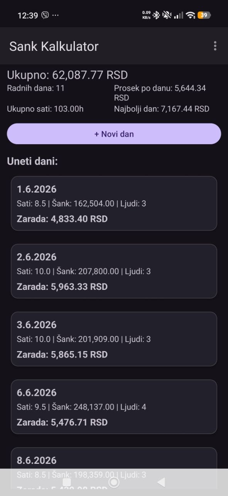
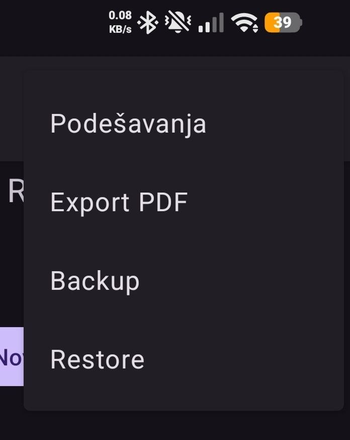

# 🍺 Šank Kalkulator

Android application for tracking monthly earnings from bar shifts.

## 📱 Features

* Create and manage multiple months
* Add daily work entries
* Select date using DatePicker
* Enter worked hours
* Enter total bar turnover for the day
* Enter the number of employees sharing the bar percentage
* Automatic earnings calculation
* Monthly statistics
* Dashboard overview
* Edit existing entries
* Delete entries and months
* PDF export and sharing
* Local data persistence using Room Database
* Custom hourly rate and bar percentage settings

---

## 🧮 Earnings Formula

```text
Daily Earnings =
(Hours Worked × Hourly Rate)
+
((Bar Turnover × Bar Percentage) / Number of Employees)
```

Example:

```text
8h × 250 RSD
+
(200,000 × 5%) / 4

= 2,000 + 2,500

= 4,500 RSD
```

---

## 📊 Statistics

For each month the application displays:

* Total earnings
* Number of work days
* Total worked hours
* Average earnings per day
* Best earning day

Dashboard overview includes:

* Total earnings across all months
* Total work days
* Total worked hours

---

## 🛠️ Technologies

* Java
* Android SDK
* Room Database
* RecyclerView
* Material Design 3
* SharedPreferences
* PDFDocument API
* FileProvider

---

## 📸 Screenshots

### Dashboard


### Month Details



### PDF Export



---

## 🚀 Installation

1. Download APK
2. Enable installation from unknown sources
3. Install the application
4. Start tracking your earnings

---

## 👨‍💻 Author

Slobodan Dudic

GitHub:
https://github.com/slobodandudic3
